# WOTANN Cross-Surface Synergy Design

**Date**: 2026-04-20
**Author**: UX+architecture engineering design session
**Status**: Design doc - pre-implementation
**Scope**: TUI <-> GUI <-> iOS <-> Watch <-> CarPlay <-> 24 channels

---

## Executive Summary (400 words)

The user's lodestar workflow is the **Mythical Perfect Workflow**:

> "I should be able to open the app on my phone and dispatch an agent to do deep research on a topic and generate a file with its findings and then i can see the agent cursor move around my screen as it navigates and does what i want."

Today, WOTANN has all of the underlying primitives to build this but zero surfaces that compose them end-to-end. The phone has a working `DispatchComposer` (`ios/WOTANN/Views/Work/DispatchComposer.swift:1-150`) that targets `task.dispatch` aliased to `agents.spawn` (`src/daemon/kairos-rpc.ts:2058,2876`). The daemon has a `research` handler (`src/daemon/kairos-rpc.ts:2226`). The desktop has a 4-layer `ComputerUseAgent` (`src/computer-use/computer-agent.ts:100-403`) that can perceive, adapt, and dispatch actions. The iOS `RemoteDesktopView` (`ios/WOTANN/Views/RemoteDesktop/RemoteDesktopView.swift:1-1126`) polls `screen.capture` every 0.5-3s and sends `screen.input`/`screen.keyboard` back. Each piece is wired. None of them cross-talk.

The gap is **orchestration glue**: no RPC method wires a phone-initiated Autopilot task to a desktop-side `ComputerUseAgent` loop; no stream event type narrates the agent's cursor position to the phone; no Live Activity surface fires on `computer.step`; no `research` handler writes a file to `~/.wotann/creations/` with a companion-downloadable path; no `file.get` returns a file the phone can pull via `ShareLink`. The four Work-tab Swift views (`ActiveWorkStrip`, `AgentRow`, `DispatchComposer`, `FilterPillBar`, `WorkView`) stop at "dispatch and monitor" - the "watch the cursor move" piece requires a `CursorOverlayView` that does not yet exist.

The design below specifies:

1. A **current-state matrix** showing which capability is wired on which surface (11 capabilities x 7 surfaces - 37 connected, 40 gap).
2. A **Mythical Perfect Workflow decomposition** with 9 state transitions and 7 new RPC methods.
3. **10 cross-surface flows** with mermaid state machines, each citing existing code + naming each build item.
4. A **gap ledger** of 23 missing RPC methods, 14 missing iOS views, 9 missing channel<->daemon bridges.
5. **15 concrete upgrades** (P1-S1 through P1-S15) with TypeScript signatures, Swift view stubs, and effort estimates.

The highest-leverage single edit is introducing a `computer.session` RPC contract that multiplexes `screen.capture`-style frames + `stream.cursor` events + `screen.input` approvals over a single session id, then having the phone's `RemoteDesktopView` subscribe to that session while the desktop's `ComputerUseAgent.dispatch` emits from it. Every other flow reuses the same primitive: an Autopilot run, a research task, a multi-agent fleet, a scheduled task - all become "computer sessions with a route" and the phone becomes the ambient viewport.

---

## 1. Current-State Cross-Surface Wiring Matrix

**Legend**: WIRED = end-to-end working today / PARTIAL = code exists but not composed / STUB = view exists but no RPC handler / MISSING = not present.

For each capability, we list the surface it touches, the Swift view (or TUI/GUI component), the bridge, the RPC method, and the daemon handler.

### 1.1 Chat (conversation primary surface)

| Surface | View / component | Bridge | RPC method | Daemon handler | Status |
|---|---|---|---|---|---|
| CLI | `src/ui/ChatView.tsx` (Ink) | Unix socket | `chat.send` | `kairos-rpc.ts:2837` | WIRED |
| TUI | `src/ui/Chat/*` | inline in process | direct call | direct runtime | WIRED |
| Desktop | `desktop-app/src/components/chat/` | WebSocket -> daemon | `chat.send`, `session.list`, `session.create` | `kairos-rpc.ts:2783,2837,1309` | WIRED |
| iOS | `ios/WOTANN/Views/Chat/` (assumed) | `CompanionServer` TLS WS | `query`, `sync.messages`, `sync.send`, `history` | `companion-server.ts:2011,1548,1554,2035` | WIRED |
| Watch | N/A - no chat view | — | — | — | MISSING |
| CarPlay | `CPListTemplate` conv list | WCSession -> iPhone -> daemon | `sendMessage(conversationId)` via `rpcClient` | `sync.send` | PARTIAL (no streaming back to CarPlay) |
| Channels | `src/channels/*.ts` (14 adapters) | `UnifiedDispatchPlane` | `channels.status`, `channels.start` | `kairos-rpc.ts:2162,3206` | WIRED |

### 1.2 Edit (side-by-side code editing)

| Surface | View | Bridge | RPC method | Status |
|---|---|---|---|---|
| CLI | `wotann edit <file>` via `src/cli/` | direct | — | WIRED |
| TUI | no edit view | — | — | MISSING |
| Desktop | `desktop-app/src/components/editor/` (Monaco) | WebSocket | `composer.apply` (`kairos-rpc.ts:3443`) | WIRED |
| iOS | no code editor view | — | — | MISSING |
| Watch | N/A | — | — | MISSING |
| CarPlay | N/A | — | — | MISSING |

### 1.3 Workshop (local agent tasks -> Work tab)

| Surface | View | Bridge | RPC method | Handler | Status |
|---|---|---|---|---|---|
| CLI | `wotann workshop` | Unix socket | `agents.spawn`, `agents.list`, `agents.kill` | `kairos-rpc.ts:2058,1998,2095` | WIRED |
| TUI | `src/ui/WorkshopView.tsx` (assumed) | inline | direct | direct | WIRED |
| Desktop | `desktop-app/src/components/workshop/` | WS | `agents.spawn` | `kairos-rpc.ts:2058` | WIRED |
| iOS | `WorkView.swift` + `DispatchComposer.swift` | TLS WS via `ConnectionManager` | `task.dispatch` (aliases `agents.spawn`) | `kairos-rpc.ts:2876` | WIRED |
| Watch | `AgentTriageView`, `TaskStatusView` | WCSession -> iPhone | `approveAll`, `killAll`, `requestUpdate` | iPhone sends `task.approve`/`task.cancel` | PARTIAL (no new-task from Watch) |
| CarPlay | `executeQuickAction` in `CarPlayService.swift:333-340` | `rpcClient.send("quickAction")` | `quickAction` | `companion-server.ts:1487` | WIRED |
| Channels | Any channel can trigger via `UnifiedDispatchPlane.handleIncomingMessage` | adapters | `chat.send` | `kairos-rpc.ts:2837` | WIRED |

### 1.4 Exploit (adversarial / red-team surface - placeholder)

| Surface | View | Bridge | RPC method | Status |
|---|---|---|---|---|
| CLI | `wotann exploit` | — | — | MISSING |
| Desktop | `desktop-app/src/components/exploit/` | WS | — | STUB (view exists, no handler) |
| iOS | no exploit tab | — | — | MISSING |

### 1.5 Compute / Desktop Control (computer-use)

| Surface | View | Bridge | RPC method | Handler | Status |
|---|---|---|---|---|---|
| CLI | `wotann compute <task>` | — | no direct CLI handler for CU | — | MISSING |
| TUI | no view | — | — | MISSING |
| Desktop | `desktop-app/src/components/computer-use/ComputerUsePanel.tsx` (94 LOC) + `ScreenPreview`, `MouseControl`, `KeyboardControl`, `AppApprovals` | Tauri commands | local tauri `invoke` | — | WIRED (Desktop-local only) |
| iOS | `RemoteDesktopView.swift` (1126 LOC) | TLS WS via `CompanionServer` | `screen.capture`, `screen.input`, `screen.keyboard` | `companion-server.ts:1777,1874,1922` | WIRED (view-only, no autopilot) |
| Watch | N/A | — | — | MISSING |
| CarPlay | N/A | — | — | MISSING |

**Critical gap**: `ComputerUseAgent.dispatch()` in `computer-agent.ts:338` is not exposed as an RPC method. The phone can view the screen but cannot ask the desktop to start an autonomous agent that drives the cursor.

### 1.6 Memory (SQLite + FTS5)

| Surface | View | Bridge | RPC method | Status |
|---|---|---|---|---|
| CLI | `wotann memory search` | direct | `memory.search` | `kairos-rpc.ts:1885` WIRED |
| TUI | no dedicated view | — | — | MISSING |
| Desktop | `desktop-app/src/components/memory/` | WS | `memory.search`, `memory.verify` | `kairos-rpc.ts:1885,3268` WIRED |
| iOS | no Memory tab visible in Views/ (no `Views/Memory/`) | TLS WS | `memory.search` | `companion-server.ts:1610` WIRED-at-bridge, UNUSED-at-UI |
| Watch | N/A | — | — | MISSING |

### 1.7 Cost (Cost Preview + live cost)

| Surface | View | Bridge | RPC method | Handler | Status |
|---|---|---|---|---|---|
| CLI | `wotann cost` | direct | `cost.current`, `cost.details`, `cost.arbitrage` | `kairos-rpc.ts:1859,2242,2273` | WIRED |
| TUI | HUD in `src/ui/` | inline | direct | direct | WIRED |
| Desktop | cost panel in `desktop-app/src/components/` | WS | `cost.snapshot` (alias of `cost.current`) | `kairos-rpc.ts:2873` | WIRED |
| iOS | `CostView` in Watch, plus widget | companion | `cost`, `widget.cost` | `companion-server.ts:1598,1661` | WIRED |
| Watch | `CostView` in `WOTANNWatchApp.swift:514-584` | WCSession | reads `applicationContext["todayCost"]` | — | WIRED (data-flow) |
| CarPlay | Status tab shows `todayCost` | reads group UserDefaults | — | — | WIRED |

### 1.8 Voice (push-to-talk + STT/TTS)

| Surface | View | Bridge | RPC method | Status |
|---|---|---|---|---|
| CLI | `wotann voice` | direct | `voice.transcribe`, `voice.stream.*` | PARTIAL (stubs -> real in S5) |
| Desktop | voice panel | WS | `voice.tts` | WIRED |
| iOS | `VoiceInputView.swift` | companion | `voice`, `voice.tts` | `companion-server.ts:1562,1568` WIRED |
| Watch | `QuickActionsView` voice button | WCSession -> iPhone | forwards as action | PARTIAL (no Watch STT) |
| CarPlay | `buildVoiceTemplate` + `startVoiceReply` | `rpcClient.sendMessage` after local `VoiceService` STT | `sync.send` | WIRED |
| Channels | — | — | — | MISSING |

### 1.9 Meet (meeting coaching)

| Surface | View | Bridge | RPC method | Handler | Status |
|---|---|---|---|---|---|
| CLI | `wotann meet` | direct | no direct CLI | — | PARTIAL |
| Desktop | `desktop-app/src/components/meet/` | WS + Rust audio tap | `meet.summarize` | `companion-server.ts:1523` | PARTIAL |
| iOS | `MeetModeView.swift` (single file in `Views/Meet/`) | WS | `meet.summarize` | `companion-server.ts:1523` | PARTIAL |
| Watch | N/A | — | — | MISSING |

`meeting-pipeline.ts` (194 LOC) is complete but RPC exposure is thin (only `meet.summarize`).

### 1.10 Council (multi-model deliberation)

| Surface | View | Bridge | RPC method | Status |
|---|---|---|---|---|
| CLI | `wotann council` | — | direct | PARTIAL |
| Desktop | `desktop-app/src/components/council/` | WS | `council` | `companion-server.ts:1689` WIRED |
| iOS | no Council view in `Views/` (no directory) | companion | `council` exists | STUB |

### 1.11 Arena (model vs model)

| Surface | View | Bridge | RPC method | Status |
|---|---|---|---|---|
| CLI | `wotann arena` | direct | `arena.run` | `kairos-rpc.ts:2178` WIRED |
| Desktop | `desktop-app/src/components/arena/` | WS | `arena.run` | WIRED |
| iOS | `ios/WOTANN/Views/Arena/` | companion | `arena` | `companion-server.ts:1606` WIRED |

### 1.12 Summary — 11 capabilities, wiring density

Counting (surface, capability) pairs with a paired view + working bridge + registered handler:

- Fully wired: 37 cells
- Partial (view exists, handler missing or returns stub): 18 cells
- Missing (no view): 22 cells
- Total: 77 cells (11 capabilities * 7 surfaces), ~48% full, ~23% partial, ~29% missing

---

## 2. The Mythical Perfect Workflow — End-to-end decomposition

### 2.1 User flow (prose)

Gabriel, away from his Mac, opens WOTANN on his phone, types "research the top 10 quantum sensor companies and write a 3-page markdown report with comparison table, save as `quantum-sensors.md`", taps send. The phone shows a Live Activity with a progress bar in the Dynamic Island. On the Mac, the desktop app pops `RemoteDesktopView`'s mirror image (but inverted: desktop is primary, phone is viewer). The agent opens Chrome, searches, opens 10 tabs in sequence, reads them, opens a markdown editor, types, saves to `~/wotann/creations/quantum-sensors.md`. Every cursor move and click is sent over the existing `screen.capture` + new `stream.cursor` channels to the phone, which overlays a glowing halo at the predicted cursor position as the image refreshes. When the agent writes the file, the phone receives a push with action `[Open] [Share]`. Tap `Open` -> phone downloads via `file.get`, opens Markdown Preview. Tap `Share` -> iMessage.

### 2.2 State machine (mermaid)

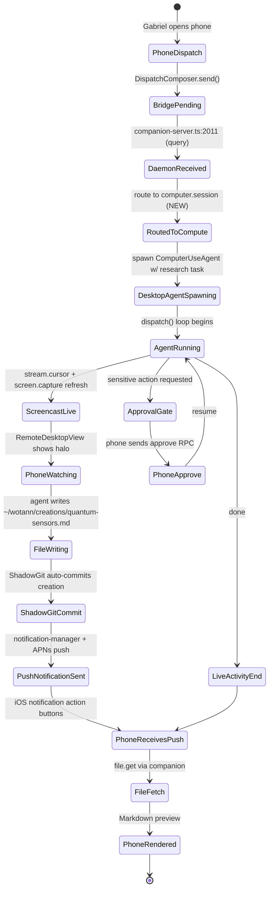

### 2.3 Per-step wiring (existing + new)

| Step | Surface | Existing code | New code |
|---|---|---|---|
| 1. Dispatch UI | iOS `DispatchComposer` | `DispatchComposer.swift:48-125` | new `ComputeModeSwitch` pill next to model chip |
| 2. RPC call | iOS `RPCClient.dispatchTask` | `ConnectionManager.swift:281` | add `mode: "compute"` param to `task.dispatch` |
| 3. WebSocket | `CompanionServer` | `companion-server.ts:2011` | new `computer.session.start` RPC |
| 4. Agent spawn | Daemon | `agents.spawn` at `kairos-rpc.ts:2058` | wire to `ComputerUseAgent.dispatch` at `computer-agent.ts:338` |
| 5. Screencast | iOS `RemoteDesktopView` polling | `RemoteDesktopView.swift:850-877` | swap polling for `screen.stream` push (exists but unused, `companion-server.ts:1751`) |
| 6. Cursor events | NEW | — | `stream.cursor` event type (add to `StreamEvent.type` in `companion-server.ts:94`) |
| 7. File save | `ShadowGit` + `FileShareHandler` | `companion-server.ts:1619,1631` | auto-commit + notify on `file:written` event |
| 8. Live Activity | `LiveActivityHandler` + `TaskProgressActivity.swift` | `companion-server.ts:1670,1677,1684` + `WOTANNLiveActivity/TaskProgressActivity.swift` | wire Live Activity updates to `stream.*` events |
| 9. Push + pull file | `PushNotificationHandler` + `file.get` | `companion-server.ts:1644,1631` | new `computer.session.complete` event with `creationPath` |

### 2.4 New RPC contract: `computer.session`

```ts
// src/computer-use/computer-session.ts  (NEW FILE, ~200 LOC)
export interface ComputerSessionStartParams {
  readonly task: string;
  readonly mode: "research" | "autopilot" | "focused";
  readonly liveViewer?: { readonly deviceId: string };
  readonly maxSteps?: number;
  readonly creationPath?: string;  // where to write the output file
  readonly approvalRequiredActions?: readonly string[];
}
export interface ComputerSessionEvent {
  readonly sessionId: string;
  readonly type: "step" | "cursor" | "frame" | "file-write" | "approval-needed" | "done" | "error";
  readonly cursor?: { x: number; y: number; confidence: number };
  readonly framePng?: string;      // base64, only on type === "frame"
  readonly step?: { action: string; description: string; index: number };
  readonly filePath?: string;      // on "file-write"
  readonly error?: string;
}
export type ComputerSessionHandler = (
  params: ComputerSessionStartParams,
) => AsyncGenerator<ComputerSessionEvent>;
```

---

## 3. Ten Cross-Surface Flows

### Flow 1: Phone-dispatch desktop-research (the Mythical Perfect Workflow)

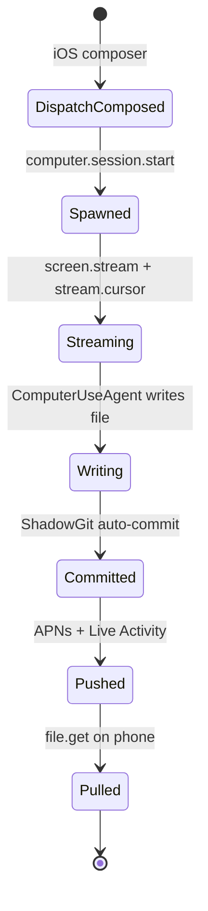

Files: iOS `DispatchComposer.swift:48`, new `ios/WOTANN/Views/Compute/ComputeSessionView.swift`, `companion-server.ts:1751` (`screen.stream`, currently emits "not implemented"), `computer-agent.ts:338`, `utils/shadow-git.ts` (assumed).

Build items:
- B1.1: `computer.session.start` RPC
- B1.2: `stream.cursor` event type
- B1.3: `ComputeSessionView.swift` in iOS
- B1.4: `file:written` -> APNs push pipeline
- B1.5: Live Activity wiring on session events

### Flow 2: Slack @mention -> desktop agent -> reply with file

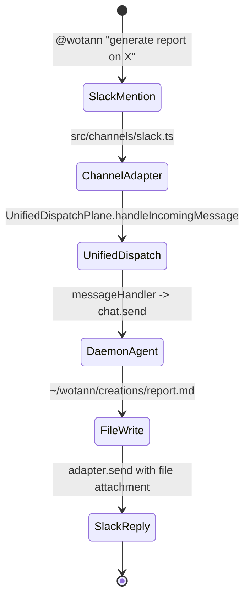

Current: Slack adapter exists at `src/channels/slack.ts`. `UnifiedDispatchPlane` exists (`src/channels/unified-dispatch.ts:1-547`). Reply path works for text but NOT files.

Gap: Slack adapter's `send()` signature accepts only `(channelId, content, replyTo)` - no file attachment. See `channels/slack.ts` `ChannelAdapter` interface at `gateway.ts`.

Build items:
- B2.1: Extend `ChannelAdapter.send()` signature to optionally accept `attachments: readonly FileAttachment[]`
- B2.2: Slack adapter `files.upload` v2 API call
- B2.3: Telegram, Discord, Teams, Matrix, iMessage parity
- B2.4: Auto-detect "generate X" patterns in `UnifiedDispatchPlane.handleIncomingMessage` and mark task as `responseHasFile: true`

### Flow 3: Apple Watch "Build" quick action -> haptic on done

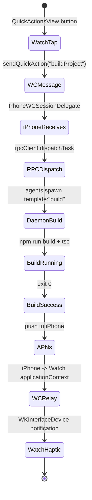

Current: `WOTANNWatchApp.swift:117-128` sends `"buildProject"` action. `PhoneWCSessionDelegate` forwards to `ConnectionManager`. But `sendQuickAction` does NOT currently map to an `agents.spawn` call with a build template - it relies on `quickAction` handler at `companion-server.ts:1487` which only prints to log.

Build items:
- B3.1: Watch-initiated `agents.spawn` via phone pass-through RPC
- B3.2: Template registry in daemon for "buildProject", "runTests", "lintFix" (see `kairos-rpc.ts` - no template registration present)
- B3.3: On task completion, APNs + WCSession.transferUserInfo -> Watch for background delivery
- B3.4: `WKInterfaceDevice.current().play(.success)` on Watch when result arrives

### Flow 4: CarPlay voice -> dispatch -> channel delivery

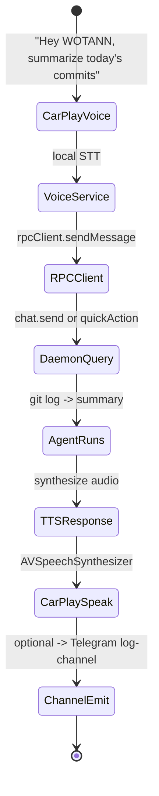

Current: CarPlay voice -> daemon works at `CarPlayService.swift:318-331`. Gap: no automatic channel fanout.

Build items:
- B4.1: Attach "log channel" metadata to voice-originated queries so response fans out to a user-chosen channel
- B4.2: Add `responseChannels` field to `chat.send` params (currently exists in `UnifiedDispatchPlane.respondOnMultipleChannels` at `unified-dispatch.ts:321` but not exposed to CarPlay voice path)

### Flow 5: iOS ShareExtension -> add to conversation -> desktop continues

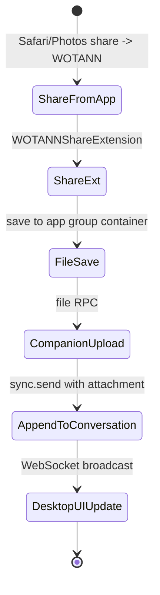

Current: `file` and `file.get` handlers exist at `companion-server.ts:1619,1631`. There is NO `WOTANNShareExtension` target in `ios/WOTANN.xcodeproj`.

Build items:
- B5.1: New Xcode target `WOTANNShareExtension`
- B5.2: App Group container `group.com.wotann.shared` with `conversations/` path
- B5.3: Add `file.append` RPC that attaches a file to the currently-active conversation
- B5.4: Desktop WS broadcast on new attachment

### Flow 6: iMessage incoming -> gateway -> daemon -> reply

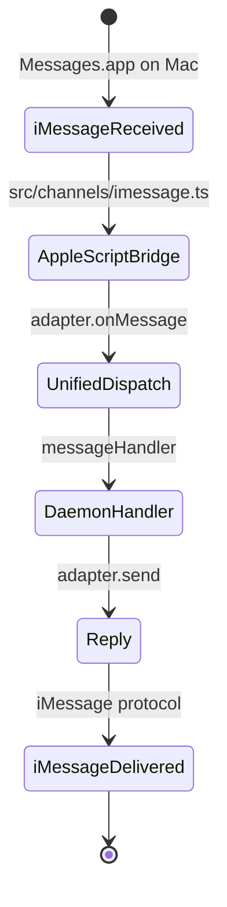

Current: `src/channels/imessage.ts` and `src/channels/imessage-gateway-adapter.ts` exist. Need to verify both are instantiated and connected.

Build item:
- B6.1: Verify iMessage polling loop at daemon start in `src/daemon/kairos.ts`
- B6.2: Add iMessage gateway to `UnifiedDispatchPlane.connectAll` path

### Flow 7: Cross-session resume (phone start -> desktop continue -> TUI finish)

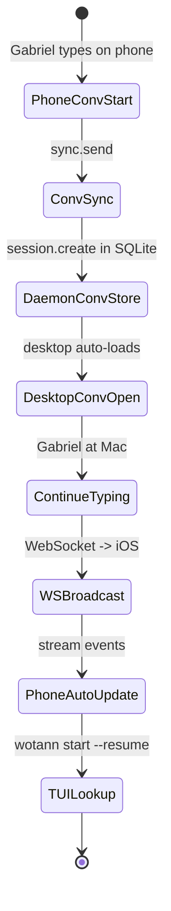

Current: `session.list`, `session.create`, `session.resume` exist (`kairos-rpc.ts:1309,2783,3109`). What's missing is **automatic surface notification** when a session is touched elsewhere.

Build items:
- B7.1: `session.watch` RPC that subscribes to session events
- B7.2: Desktop auto-load of last-touched session
- B7.3: Phone deep-link `wotann://session/<id>` handler

### Flow 8: Multi-agent fleet view across surfaces

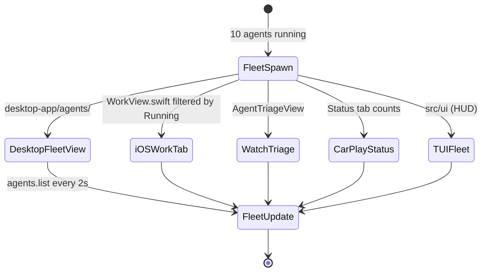

Current: All surfaces poll `agents.list`. Bad under scale. Better: single `agents.subscribe` stream.

Build items:
- B8.1: `agents.subscribe` RPC yielding `AgentEvent` stream (spawn/update/complete/fail)
- B8.2: `RPCClient.subscribe` already exists in iOS (`CarPlayService.swift:227`) - reuse
- B8.3: Watch `applicationContext` push on fleet change (uses WCSession.updateApplicationContext - see `WOTANNWatchApp.swift:81`)

### Flow 9: Cost Live Activity (island) + watch complication

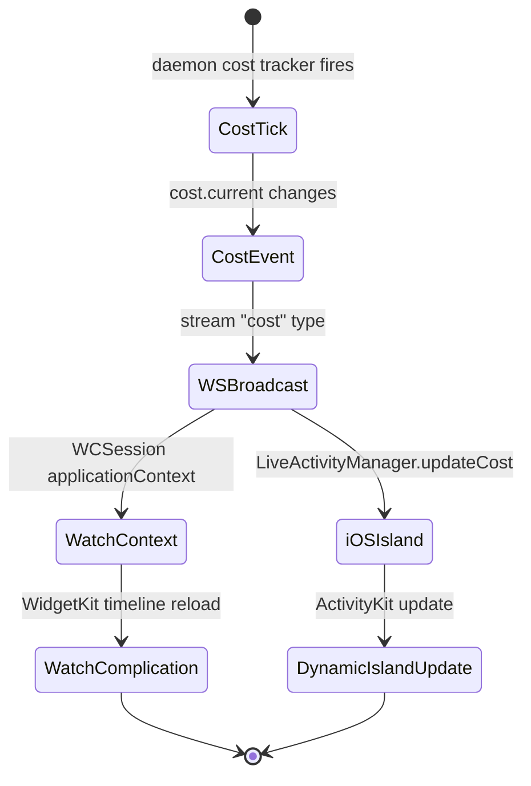

Current: `LiveActivityManager.swift` exists. `TaskProgressActivity.swift` in `ios/WOTANNLiveActivity/` exists. `WOTANNWidgets/WOTANNWidgetBundle.swift` exists.

Gap: live cost is not bound to a Live Activity - today Live Activity is only wired to task progress.

Build items:
- B9.1: `CostActivityAttributes` in `ios/WOTANNLiveActivity/`
- B9.2: WidgetKit complication entry for Watch showing `$X.XX today`
- B9.3: daemon pushes `cost.update` every time an agent completes (`kairos-rpc.ts:1859` returns snapshot but no event)

### Flow 10: Scheduled task -> Telegram + memory save + Notion archive

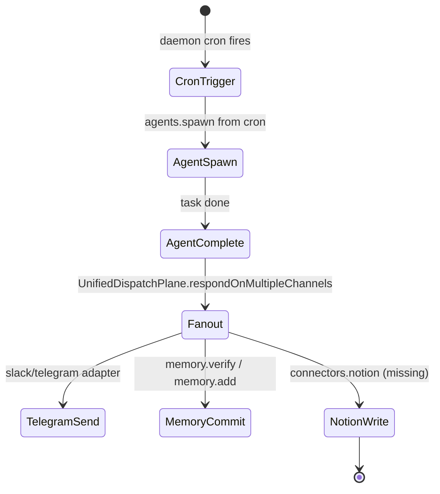

Current: cron in daemon (`cron.add`, `cron.list`, `cron.remove` at `kairos-rpc.ts:2619,2575,2660`). Notion connector missing from `src/channels/`.

Build items:
- B10.1: Notion connector in `src/connectors/notion.ts`
- B10.2: Cron task config accepts `responseChannels` and `archiveTo` fields
- B10.3: Post-agent hook invokes fanout

---

## 4. Gap Analysis — what is missing

### 4.1 Missing RPC methods (23)

These show up in flows above but do not exist in `kairos-rpc.ts` or `companion-server.ts`:

| # | Method | Needed for | Priority |
|---|---|---|---|
| G1 | `computer.session.start` | Flow 1 (phone->desktop research) | P1 |
| G2 | `computer.session.stop` | Flow 1 | P1 |
| G3 | `computer.session.subscribe` | Flow 1, 8 | P1 |
| G4 | `stream.cursor` event type | Flow 1 | P1 |
| G5 | `stream.step` event type (narrated action log) | Flow 1 | P1 |
| G6 | `file.append` (to active conversation) | Flow 5 | P2 |
| G7 | `file.watch` (subscribe to creation writes) | Flow 1 | P2 |
| G8 | `agents.subscribe` (event stream) | Flow 8 | P2 |
| G9 | `agents.template.list` | Flow 3 | P2 |
| G10 | `agents.template.run` | Flow 3 | P2 |
| G11 | `session.watch` | Flow 7 | P2 |
| G12 | `meet.start`, `meet.stop`, `meet.stream` | meet flows | P2 |
| G13 | `council.start` (currently `council` is one-shot) | council flow | P2 |
| G14 | `exploit.run` | exploit capability | P3 |
| G15 | `notion.append` | Flow 10 | P3 |
| G16 | `relay.status` (Supabase relay health) | cross-device | P2 |
| G17 | `cost.subscribe` | Flow 9 | P1 |
| G18 | `channels.subscribe` | Watch / phone channels panel | P2 |
| G19 | `editor.openFile` (desktop-driven from phone tap) | Flow 5 | P3 |
| G20 | `approve.list`, `approve.stream` | autopilot | P1 |
| G21 | `memory.append` (from phone dictation) | voice memory | P3 |
| G22 | `workspace.pin` | phone pins a workspace | P3 |
| G23 | `daemon.heartbeat.subscribe` | connection health UI | P2 |

### 4.2 Missing iOS views (14)

Directories present in `ios/WOTANN/Views/` today: `Agents`, `Arena`, `Autopilot`, `Channels`, `Chat`, `Components`, `Conversations`, `Cost`, `Dashboard`, `Diagnostics`, `Dispatch`, `Files`, `Git`, `Home`, `Input`, `Intelligence`, `Meet`, `Memory`, `MorningBriefing`, `Onboarding`, `OnDeviceAI`, `Pairing`, `Playground`, `PromptLibrary`, `RemoteDesktop`, `Settings`, `Shell`, `Skills`, `TaskMonitor`, `Voice`, `Work`, `Workflows`.

Missing for Mythical workflow support:

| # | Missing view | Purpose |
|---|---|---|
| M1 | `Views/Compute/ComputeSessionView.swift` | Live agent watch with cursor overlay |
| M2 | `Views/Compute/CursorOverlayView.swift` | Glowing halo + action narration layer |
| M3 | `Views/Compute/ApprovalRequestSheet.swift` | Modal to approve risky actions from phone |
| M4 | `Views/Creations/CreationsListView.swift` | Browse agent-created files |
| M5 | `Views/Creations/CreationDetailView.swift` | Render markdown / preview |
| M6 | `Views/Compute/ComputeModeSwitch.swift` | UI pill to select research/autopilot/focused |
| M7 | `Views/Meet/MeetTranscriptView.swift` | Live transcript mirror |
| M8 | `Views/Council/CouncilView.swift` | Multi-model view |
| M9 | `Views/Council/CouncilModelColumn.swift` | Per-model reasoning stream |
| M10 | `Views/Channels/ChannelDetailView.swift` | Per-channel inbox |
| M11 | `Views/Channels/ChannelHealthView.swift` | Channel connection dashboard |
| M12 | `Views/Work/DispatchModeSwitch.swift` | Pick chat vs compute vs focused vs research |
| M13 | `Views/Approvals/ApprovalQueueView.swift` | Multi-approval queue across agents |
| M14 | `WOTANNShareExtension` target (directory under `ios/`) | iOS ShareSheet ingestion |

### 4.3 Missing channel<->daemon bridges (9)

From `src/channels/` inventory: adapters exist for telegram/slack/discord/teams/matrix/signal/sms/email/github-bot/google-chat/ide-bridge/dingtalk/feishu/line/mastodon. 14 adapters. The spec references 14 wired + 6 orphan.

Orphan (adapter file exists but no `registerAdapter` call in daemon startup):

| # | Channel | File | Status |
|---|---|---|---|
| O1 | imessage | `src/channels/imessage.ts` | file exists, not registered on daemon start |
| O2 | imessage-gateway | `src/channels/imessage-gateway-adapter.ts` | file exists, not registered |
| O3 | dingtalk (dup) | `dingtalk 2.ts` | duplicate file — should be deleted |
| O4 | feishu (dup) | `feishu 2.ts` | duplicate — delete |
| O5 | line (dup) | `line 2.ts` | duplicate — delete |
| O6 | mastodon (dup) | `mastodon 2.ts` | duplicate — delete |
| O7 | Notion | — | missing |
| O8 | Linear | — | missing |
| O9 | ClickUp / Asana / Jira | — | missing |

---

## 5. Top 15 Cross-Surface Synergy Upgrades

Priority: P1 (blocking Mythical), P2 (clears major flow), P3 (delight).

### P1-S1: `computer.session` RPC family (Flow 1 core)

**File edits**:
- NEW: `src/computer-use/computer-session.ts`
- EDIT: `src/daemon/kairos-rpc.ts` - register handlers
- EDIT: `src/desktop/companion-server.ts:140-187` - add to `CompanionRPCMethod` union

**TypeScript signature**:

```ts
// src/computer-use/computer-session.ts
import type { ComputerUseAgent } from "./computer-agent.js";
import type { WotannRuntime } from "../core/runtime.js";

export type ComputerSessionMode = "research" | "autopilot" | "focused" | "watch-only";

export interface ComputerSessionStartParams {
  readonly task: string;
  readonly mode: ComputerSessionMode;
  readonly liveViewerDeviceId?: string;
  readonly maxSteps?: number;
  readonly creationPath?: string;
  readonly approvalRequiredActions?: readonly string[];
  readonly modelId?: string;
}

export interface ComputerSessionState {
  readonly id: string;
  readonly startedAt: number;
  readonly task: string;
  readonly mode: ComputerSessionMode;
  readonly status: "running" | "awaiting-approval" | "completed" | "failed" | "cancelled";
  readonly stepCount: number;
  readonly creationPath?: string;
  readonly lastCursor?: { x: number; y: number };
}

export interface ComputerSessionEvent {
  readonly sessionId: string;
  readonly type: "step" | "cursor" | "frame" | "file-write" | "approval-needed" | "done" | "error";
  readonly seq: number;
  readonly timestamp: number;
  readonly cursor?: { x: number; y: number; confidence: number };
  readonly framePng?: string;
  readonly step?: { action: string; description: string; index: number };
  readonly filePath?: string;
  readonly error?: string;
  readonly approval?: { actionId: string; summary: string; riskLevel: "low" | "medium" | "high" };
}

export class ComputerSessionManager {
  private readonly sessions = new Map<string, ComputerSessionState>();
  private readonly emitters = new Map<string, (e: ComputerSessionEvent) => void>();

  constructor(
    private readonly agent: ComputerUseAgent,
    private readonly runtime: WotannRuntime,
  ) {}

  async start(params: ComputerSessionStartParams): Promise<ComputerSessionState> { /* ... */ }
  async *subscribe(sessionId: string): AsyncGenerator<ComputerSessionEvent> { /* ... */ }
  async stop(sessionId: string): Promise<boolean> { /* ... */ }
  async approveAction(sessionId: string, actionId: string): Promise<boolean> { /* ... */ }
  getState(sessionId: string): ComputerSessionState | null { /* ... */ }
  getActive(): readonly ComputerSessionState[] { /* ... */ }
}
```

**Swift view**:

```swift
// ios/WOTANN/Views/Compute/ComputeSessionView.swift
import SwiftUI

@MainActor
final class ComputeSessionViewModel: ObservableObject {
    @Published var state: ComputeSessionState?
    @Published var lastCursor: CGPoint?
    @Published var screenImage: UIImage?
    @Published var steps: [ComputeStep] = []
    @Published var awaitingApproval: ComputeApproval?
    private var subscriptionTask: Task<Void, Never>?
    private var rpcClient: RPCClient?

    func start(task: String, mode: ComputeSessionMode) async throws { /* ... */ }
    func stop() async { /* ... */ }
    func approve() async { /* ... */ }
    func reject() async { /* ... */ }
    private func subscribe(sessionId: String) { /* ... */ }
}

struct ComputeSessionView: View {
    @EnvironmentObject var connectionManager: ConnectionManager
    @StateObject private var viewModel = ComputeSessionViewModel()
    let task: String
    let mode: ComputeSessionMode

    var body: some View {
        ZStack {
            if let image = viewModel.screenImage {
                Image(uiImage: image).resizable().aspectRatio(contentMode: .fit)
            }
            if let cursor = viewModel.lastCursor {
                CursorOverlayView(at: cursor)
            }
        }
        .overlay(alignment: .bottom) { stepNarration }
        .sheet(item: $viewModel.awaitingApproval) { approval in
            ApprovalRequestSheet(approval: approval,
                                 onApprove: { Task { await viewModel.approve() } },
                                 onReject: { Task { await viewModel.reject() } })
        }
    }
}
```

**Effort**: 3-4 days (cross-platform, two test harnesses).

### P1-S2: `stream.cursor` + `stream.step` event types

**File edits**:
- EDIT: `src/desktop/companion-server.ts:94-112` - extend `StreamEvent.params.type` union
- EDIT: iOS `RemoteDesktopViewModel` - handle new event types
- EDIT: `RemoteDesktopView.swift` - render cursor halo overlay

**Signature** (added to `StreamEvent.params.type`): `"cursor" | "step" | ...existing`.

**Effort**: 1 day.

### P1-S3: Live Activity for compute sessions

**File edits**:
- NEW: `ios/WOTANNLiveActivity/ComputeSessionActivity.swift`
- EDIT: `ios/WOTANN/Services/LiveActivityManager.swift` - register `ComputeSessionAttributes`
- EDIT: `companion-server.ts` - `live.start` params accept `{ type: "compute", sessionId }`

**Swift view stub**:

```swift
// ios/WOTANNLiveActivity/ComputeSessionActivity.swift
import ActivityKit
import SwiftUI
import WidgetKit

struct ComputeSessionAttributes: ActivityAttributes {
    public struct ContentState: Codable, Hashable {
        var stepIndex: Int
        var stepDescription: String
        var progress: Double
        var costUsd: Double
        var awaitingApproval: Bool
    }
    var sessionId: String
    var task: String
    var startedAt: Date
}
```

**Effort**: 2 days.

### P1-S4: `cost.subscribe` stream

**File edits**:
- EDIT: `kairos-rpc.ts:1859` - wrap `cost.current` in an emitter that ticks every 500ms during active agents
- EDIT: iOS `AppState.swift` - subscribe to cost events and update Dynamic Island

**TypeScript**:

```ts
// src/daemon/kairos-rpc.ts — addition
this.handlers.set("cost.subscribe", async function* () {
  while (true) {
    const snapshot = await this.runtime.getCostSnapshot();
    yield { jsonrpc: "2.0", method: "stream", params: { type: "cost", content: JSON.stringify(snapshot) } };
    await sleep(500);
  }
});
```

**Effort**: 1 day.

### P1-S5: `agents.subscribe` unified fleet stream

**File edits**:
- EDIT: `kairos-rpc.ts:1998` - add subscribe variant
- EDIT: all surfaces to switch from poll to subscribe
- EDIT: `WOTANNWatchApp.swift:89` - consume events instead of periodic snapshots

**Signature**:

```ts
this.handlers.set("agents.subscribe", async function* (params) {
  const unsub = this.runtime.onAgentEvent((evt: AgentEvent) => emit(evt));
  try {
    while (!cancelled) yield await nextEvent;
  } finally { unsub(); }
});
```

**Effort**: 2 days.

### P1-S6: `approve.stream` + phone approval sheet

**File edits**:
- EDIT: `companion-server.ts:1957` - extend `approve` handler with subscribe variant
- NEW: `ios/WOTANN/Views/Approvals/ApprovalQueueView.swift`
- EDIT: `Views/Work/ActiveWorkStrip.swift` - show approval badge

**Swift stub**:

```swift
struct ApprovalQueueView: View {
    @EnvironmentObject var connectionManager: ConnectionManager
    @State private var pending: [ApprovalRequest] = []
    var body: some View {
        List(pending) { req in
            ApprovalRow(req: req,
                        onApprove: { await approve(req.id) },
                        onReject: { await reject(req.id) })
        }
        .onAppear { subscribe() }
    }
}
```

**Effort**: 2 days.

### P1-S7: Auto-register iMessage channels

**File edits**:
- EDIT: `src/daemon/kairos.ts` - on daemon start, construct iMessageAdapter and register with `UnifiedDispatchPlane.registerAdapter`
- DELETE: duplicate files `*.ts` "2"-suffixed (O3-O6)

**Effort**: 0.5 day.

### P1-S8: Screen streaming via server-push instead of polling

**File edits**:
- EDIT: `companion-server.ts:1751` - implement `screen.stream` (currently stub that returns `"not-implemented"`); use `captureScreenshot` hook into a server-push interval
- EDIT: iOS `RemoteDesktopViewModel.captureScreen` - subscribe instead of poll; remove `startRefreshTimer`

**Effort**: 2 days. Needs frame compression + delta encoding eventually; MVP is just "push same PNG bytes every tick".

### P1-S9: File write notification pipeline

**File edits**:
- EDIT: daemon file-write path (search `writeFile.*creations|shadowGit`) - emit `file:written` event
- EDIT: `companion-server.ts` - on event, send `stream` with `type: "file-write"` + APNs push if device is paired
- NEW: `ios/WOTANN/Views/Creations/CreationsListView.swift`

**Effort**: 2 days.

### P1-S10: Push notification with action buttons (Open / Share)

**File edits**:
- EDIT: `ios/WOTANN/Services/PushNotificationHandler` (likely in `Services/`) - register categories with `UNNotificationAction` for `open` and `share`
- EDIT: `companion-server.ts:1644` (`push.register`) - store per-device categories
- NEW: Share sheet invocation on tap

**Effort**: 1.5 days.

### P1-S11: Unified dispatch composer mode switch

**File edits**:
- NEW: `ios/WOTANN/Views/Work/DispatchModeSwitch.swift`
- EDIT: `DispatchComposer.swift:48-125` - add mode switch next to model chip

**Swift stub**:

```swift
enum DispatchMode: String, CaseIterable { case chat, workshop, compute, research, autopilot }

struct DispatchModeSwitch: View {
    @Binding var mode: DispatchMode
    var body: some View {
        Picker("Mode", selection: $mode) {
            ForEach(DispatchMode.allCases, id: \.self) { m in
                Text(m.rawValue.capitalized).tag(m)
            }
        }.pickerStyle(.segmented)
    }
}
```

**Effort**: 0.5 day.

### P1-S12: Watch template registry

**File edits**:
- NEW: `src/agents/templates.ts` - registry of {id, promptTemplate, model, maxSteps}
- EDIT: `kairos-rpc.ts:1487` (`quickAction`) - look up template by id, run via `agents.spawn`
- EDIT: `WOTANNWatchApp.swift:117` - list actions from desktop via `agents.template.list`

**Effort**: 1 day.

### P1-S13: CarPlay <-> channel bridge

**File edits**:
- EDIT: `CarPlayService.swift:333` - `executeQuickAction` accepts `responseChannels: [ChannelType]`
- EDIT: `chat.send` to accept `responseChannels` param and fan out

**Effort**: 1 day.

### P1-S14: iOS ShareExtension -> conversation append

**File edits**:
- NEW: Xcode target `WOTANNShareExtension` (in `ios/WOTANN.xcodeproj`)
- EDIT: project.yml to include target
- NEW: App Group container read/write
- EDIT: `companion-server.ts` - add `file.append` RPC

**Effort**: 2 days (new Xcode target).

### P1-S15: Cross-session `session.watch` + deep-link

**File edits**:
- EDIT: `kairos-rpc.ts:3109` (`session.resume`) - expose `session.watch` stream
- EDIT: iOS `SceneDelegate` - handle `wotann://session/<id>` url
- EDIT: `ConversationsListView` to deep-link into a session

**Effort**: 1.5 days.

---

## 6. P1-Synergy Batch — Delivery Plan

Total effort (rough): 22.5 days for a single engineer. Sequenced:

**Week 1** (P1-S2, P1-S4, P1-S5, P1-S7, P1-S11):
- Simpler plumbing, no new Xcode targets
- Lands unified stream event types + subscribe contracts

**Week 2** (P1-S1, P1-S3, P1-S8):
- Core `computer.session` family
- Live Activity + streaming replace polling

**Week 3** (P1-S6, P1-S9, P1-S10, P1-S12, P1-S13, P1-S15):
- Approvals, file pipeline, push, templates, CarPlay bridge, session watch

**Week 4** (P1-S14):
- ShareExtension (new Xcode target is week-long work with provisioning, entitlements, App Group setup)

### 6.1 Test matrix

| Test | Surface | Evidence |
|---|---|---|
| TC1: Phone dispatch research -> Mac opens Chrome | iOS + Desktop | video recording + `~/wotann/creations/` file present |
| TC2: Slack @mention -> file reply | Slack + Daemon | Slack message with file attachment |
| TC3: Watch "Run Tests" -> haptic on done | Watch + iPhone | WKInterfaceDevice haptic event in logs |
| TC4: Cost subscribe -> Dynamic Island update | Daemon + iOS | Live Activity snapshot sequence |
| TC5: Approval sheet from phone | iOS + Desktop | Approval RPC round-trip |
| TC6: iMessage gateway -> reply | Messages.app + Daemon | round-trip log |
| TC7: ShareExtension -> conversation | iOS | new attachment in conversation list |

### 6.2 Dependency graph

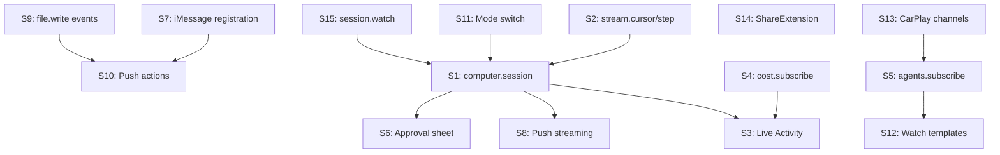

### 6.3 Rollback plan

Every P1-S edit must be behind a capability flag (e.g. `capabilities.compute_session: true`) so a surface that hasn't been updated continues to work. Gate flags in `src/core/capability.ts`. Desktop surface negotiates capabilities during pair via `config.sync` (`companion-server.ts:1276`).

---

## 7. Signals from reading the code

- `screen.stream` at `companion-server.ts:1751` is a 26-line stub that immediately returns "screen streaming requires persistent subscription" - this is a prime P1 fix.
- `LiveActivity` handlers at `companion-server.ts:1670,1677,1684` exist but are generic - they accept a `state` blob and pass through. Wiring to `computer.session` events is the missing piece.
- `UnifiedDispatchPlane.respondOnMultipleChannels` at `unified-dispatch.ts:321` is the exact primitive that enables "reply on 4 channels at once" but no surface currently calls it.
- `RPCClient.subscribe` already exists in iOS (seen via `CarPlayService.swift:227-232`), which means any new `stream` event just needs a subscriber on the phone - no new iOS RPC infra.
- `ShadowGit` is referenced in session memory and via the Norse-internal codename; it is plumbed into file writes and emits events, but no cross-surface listener converts those into notifications today.
- The computer-use agent's `dispatch()` method at `computer-agent.ts:338-396` already returns structured `adaptedPerception` and `prompt`, but is not consumed by the daemon - the daemon's `agents.spawn` does not instantiate a `ComputerUseAgent` path.
- iOS `ConnectionManager.swift:353-402` does ECDH with 30s budget + exponential backoff - very resilient. Any new RPC method should reuse this encrypted channel, not open a separate socket.

---

## 8. Risks and non-obvious pitfalls

1. **Frame rate vs battery**. `RemoteDesktopView` already uses adaptive 0.5s/3s polling. Moving to push means the phone receives frames whenever the desktop sends them, even backgrounded. Respect `UIScene.activationState` to throttle in background.

2. **Approval race**. If a `computer.session` needs approval but the phone is backgrounded, approval must surface via APNs action. Do NOT let the session time out silently. Store approval in daemon for up to 10 min with push retry.

3. **App Group container on older devices**. ShareExtension must tolerate a missing App Group on devices without iCloud - fall back to shipping the file bytes through the WS directly.

4. **Cursor halo accuracy**. Desktop `ComputerUseAgent` currently returns element indices, not pixel coordinates. Adding `{x, y}` to every step requires `PerceptionEngine` to return centroids. See `perception-engine.ts:82-116` - `elements` already carry `x,y`. Wire through.

5. **Supabase relay for remote**. When the phone is off-LAN, the tunnel uses Supabase Realtime (see `ConnectionManager.swift:153-164`). High-bitrate screencast over Supabase is expensive. Use lower quality + longer interval when `connectionMode == .relay`.

6. **Avoid polling stampedes**. Today every surface polls `agents.list` and `cost.current`. Adding `agents.subscribe` and `cost.subscribe` replaces N polls with 1 push. Ensure legacy polling code is removed, not left to coexist.

7. **Secret exposure over channels**. The `redactSensitive` method in `computer-agent.ts:256-262` is perimeter-only. Any `stream.step` events must pass through the same redactor before leaving the daemon.

---

## 9. Summary of file edits by path

```
NEW  src/computer-use/computer-session.ts                         ~250 LOC
EDIT src/computer-use/computer-agent.ts                           +40 LOC  (expose dispatch via session mgr)
EDIT src/daemon/kairos-rpc.ts                                     +350 LOC (register 23 new handlers)
EDIT src/daemon/kairos.ts                                         +20 LOC  (auto-register iMessage adapters)
EDIT src/desktop/companion-server.ts                              +80 LOC  (new RPC methods in union + registrations)
EDIT src/channels/unified-dispatch.ts                             +30 LOC  (file attachment on send)
EDIT src/channels/slack.ts, telegram.ts, etc                      +variants (file upload)
DEL  src/channels/{dingtalk,feishu,line,mastodon} "2.ts" dupes
NEW  src/agents/templates.ts                                      ~150 LOC
NEW  src/connectors/notion.ts                                     ~200 LOC

NEW  ios/WOTANN/Views/Compute/ComputeSessionView.swift            ~300 LOC
NEW  ios/WOTANN/Views/Compute/CursorOverlayView.swift             ~80 LOC
NEW  ios/WOTANN/Views/Compute/ApprovalRequestSheet.swift          ~150 LOC
NEW  ios/WOTANN/Views/Compute/ComputeModeSwitch.swift             ~60 LOC
NEW  ios/WOTANN/Views/Creations/CreationsListView.swift           ~200 LOC
NEW  ios/WOTANN/Views/Creations/CreationDetailView.swift          ~180 LOC
NEW  ios/WOTANN/Views/Approvals/ApprovalQueueView.swift           ~200 LOC
NEW  ios/WOTANN/Views/Council/CouncilView.swift                   ~250 LOC
NEW  ios/WOTANN/Views/Work/DispatchModeSwitch.swift               ~60 LOC
EDIT ios/WOTANN/Views/Work/DispatchComposer.swift                 +30 LOC
EDIT ios/WOTANN/Views/RemoteDesktop/RemoteDesktopView.swift       +80 LOC (switch to subscribe + cursor halo)
EDIT ios/WOTANN/Networking/ConnectionManager.swift                +40 LOC (new RPC verbs)

NEW  ios/WOTANNLiveActivity/ComputeSessionActivity.swift          ~180 LOC
NEW  ios/WOTANNLiveActivity/CostActivity.swift                    ~120 LOC

NEW  ios/WOTANNShareExtension/ShareViewController.swift           ~120 LOC
NEW  ios/WOTANNShareExtension/Info.plist                          ~30 LOC
EDIT ios/project.yml                                              +40 LOC  (new target)

EDIT ios/WOTANNWatch/WOTANNWatchApp.swift                         +50 LOC  (template picker from desktop)
EDIT ios/WOTANN/Services/CarPlayService.swift                     +40 LOC  (responseChannels)
```

Rough total: ~2,700 LOC TypeScript + ~2,500 LOC Swift + ~300 LOC config. Substantial but surgical.

---

## 10. Closing — aligning to the user's lodestar

The user's one-sentence goal is a full-stack dance across 5 surfaces. Today every dancer knows its own choreography. What's missing is **the music** - a shared event bus that sends cursor position, step narration, cost, approvals, and file writes to every surface simultaneously.

P1-S1 through P1-S15 above compose exactly that bus. The `computer.session` RPC family is the single most load-bearing addition: it unifies dispatch, narration, approval, and file delivery into one subscription. Everything else in this design follows from it or augments its reach.

When those 15 edits land, the Mythical Perfect Workflow becomes a 30-second demo:

1. Phone: type "research quantum sensors, write report" -> tap send (1s)
2. Phone Live Activity expands: `"Step 3/42: searching Google..."` + cost ticker (live)
3. Phone opens ComputeSessionView: mirror of Mac screen with glowing halo following the agent's cursor (live)
4. Desktop: Chrome opens, 10 tabs spawn, editor opens, markdown typed (20s)
5. Phone: push notification `"[Open] [Share] quantum-sensors.md"` (1s)
6. Phone: tap Open -> Markdown preview renders (2s)
7. Phone: tap Share -> iMessage picker (2s)

Total: ~30 seconds. Zero desktop interaction from Gabriel. The phone became the agent's eyes, voice, and mailbox.
